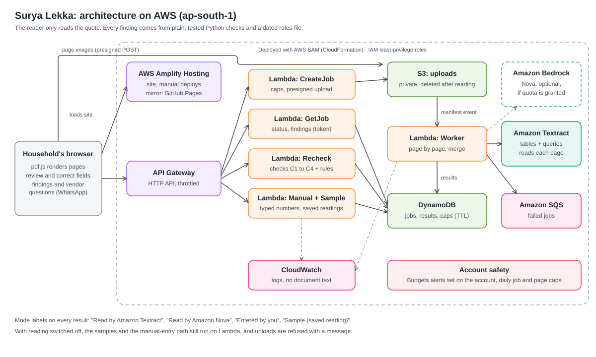

# Surya Lekka

Surya Lekka checks a household's rooftop solar quote before they sign. It reads the quote, shows the line each number came from, checks the sums and the central subsidy against the government rule, and lists what to ask the vendor.

## Press release

This is a Working Backwards press release, written before launch to describe the product we are building.

### Surya Lekka helps households check a rooftop solar quote before they sign

Read the quote, check the numbers and the subsidy rule, and know what to ask the vendor.

A rooftop solar quote packs a lot into a page or two: how many panels and of what wattage, the system size, the price with GST and extra charges, and the subsidy the vendor expects the household to get. Under PM Surya Ghar, the central subsidy depends on the DC capacity of the panels, the household's state, and when they applied on the National Portal, and it needs DCR panels made from Indian cells. Checking all of that by hand means finding each figure on the quote, knowing which rule applies, and redoing the sums.

With Surya Lekka, a household uploads the quote as a PDF or as photos of its pages. Amazon Textract reads each page, answering a fixed set of questions and reading its tables, and the app keeps the exact line each value came from, or says "not found". (Amazon Nova on Amazon Bedrock can read the quote instead once the account has Bedrock access.) The household confirms or corrects every value and answers a few questions, such as their state and when they applied. Plain, tested Python code then runs the checks. Each finding shows the line from the quote, the rule it was checked against and the rule's date. The details the quote leaves out become a short, polite message to copy or send to the vendor on WhatsApp. Anyone who would rather not upload anything can type the numbers in instead.

> "I had the quote on my phone and the vendor wanted an answer. It showed me the panel count didn't add up to the system size and gave me the questions to send back."
>
> An illustrative household quote, written for this press release. It is not from a real user.

## FAQ

### What does it check?

Four things. Whether the number of panels times their wattage matches the system size the quote states (C1). Whether the central subsidy on the quote matches the rule for that panel capacity (C2). Whether the price, GST, extra charges, discount, subsidy and net cost add up (C3). And which details the quote leaves out, such as the exact panel and inverter models, the DCR declaration and the vendor's registration number (C4).

### What does it never do?

It never recommends a system size, predicts savings or payback, ranks vendors, accuses a vendor of anything or certifies that a household is eligible for the subsidy. It never says a quote is "safe". State subsidies are marked "not checked". Every check ends in one of five plain results: matches, doesn't match, missing, needs checking, or not checked.

### What happens to my quote?

The page turns your quote into page images on your own device and only those images are uploaded. On the public site the notice reads: "Your pages are read by Amazon Textract in AWS's Mumbai region (India) and deleted from our storage after reading. This AWS account has opted out of AWS using them to improve its services. If reading fails, they're removed automatically, usually within two days." Logs hold job ids, timings and reason codes, never the text of your quote. See [Privacy and safety](#privacy-and-safety) for the details, including the notice shown when Amazon Textract reads the pages and what changes when Nova is reached through a cross-Region inference profile.

### Why not just use a subsidy calculator?

A calculator needs you to find each number, know which figure is the DC panel capacity, and know which rule and date apply to you. Surya Lekka starts from the quote itself. It shows where each number came from, checks the quote's own arithmetic as well as the subsidy, and turns what's missing into questions for the vendor.

## How it works



1. In the browser, pdf.js turns each page of a PDF into a JPEG (at most 20 pages, each under 3,750,000 bytes and 8,000 pixels a side). Photos are scaled down to fit the same limits. Nothing leaves the device at this step.
2. The page asks the API for a job. It gets back a secret job token and presigned POSTs, and uploads the page images straight to a private S3 bucket, then a small manifest.
3. The manifest's S3 event starts the worker Lambda. It claims the job with a conditional write, so a duplicate event does nothing, and reads the pages with the stack's reading engine:
   - Amazon Textract (`ReadingEngine=textract`): one AnalyzeDocument call per page with the page bytes, asking for tables and 15 fixed questions (`src/extract/textract_queries.py`). Each answer keeps its own text, the full lines it sits on and its page. An answer below the confidence threshold (50 out of 100, chosen on our development quotes), one that doesn't parse as its field's type, or one on no line of the page is dropped. Every remaining answer is kept page by page, so two pages that disagree reach the household as a conflict to resolve. A table gives several options only when two or more of its rows each have a different system size and a price. The same reply is also read for lines that name their own value ("Grand total Rs. 1,65,850/-", "No. of modules: 5") and for bill-of-materials rows that tie a panel count to its wattage and make. A line that names no role, or two, gives nothing, a percentage is never an amount, and one printed amount never fills two fields. Values the sources disagree on stay a conflict for the household. A valid GSTIN's state code shows where the vendor is registered for GST, as information only; it never fills in the household's state.
   - Amazon Nova (`ReadingEngine=nova`): batches of at most five images, answered through a fixed JSON schema in which each field gets a value and the exact text it came from, or "not found".

   The worker saves each page or batch as it arrives, so a retry only reads the rest.
4. The worker merges the batches, runs the checks, stores the result in DynamoDB and deletes the uploaded pages.
5. The review screen shows every value next to its source text and a thumbnail of the user's own page. The user corrects anything wrong, can add a charge the reading missed, says whether every charge on the quote is listed, and answers the questions the rules need. The checks run again on the corrected values, and each correction is stored as the user's.
6. The results screen groups the findings by outcome and offers the vendor questions with Copy and Send on WhatsApp buttons.

There are two other ways in. The three samples are made-up quotes with saved readings, so trying one never calls the model. "Type the numbers instead" sends the figures the user types straight to the checks, with nothing stored. Every result carries a label saying where its values came from: "Read by Amazon Textract", "Read by Amazon Nova", "Sample (saved reading)" or "Entered by you".

The stack is defined in `template.yaml` (AWS SAM): an HTTP API on API Gateway, seven Lambda functions on Python 3.12, a private S3 bucket for uploads, DynamoDB for jobs, an SQS queue for worker events that failed, CloudWatch logs kept for 7 days, X-Ray tracing, and the web app in a second private bucket behind CloudFront.

While our AWS account is blocked from creating CloudFront distributions, the public site is served from GitHub Pages instead, at https://vabhishekprakash.github.io/surya-lekka/, and talks to the same API. The template still supports CloudFront: `HostingEnabled` is only switched off until the account is verified.

## What it checks

The checks are plain Python in `src/checks/` and use `Decimal` for money. Each finding carries its status, the quote lines it used, any value it worked out (labelled as computed), and the rule id and date where a rule applies.

### C1: system size

Panel count times panel wattage, compared with the system size on the quote, only when the quote says that size is the DC capacity of the panels (kWp). If the size is given in kVA, as AC or inverter capacity, or without saying what it measures, the two aren't compared and the household is asked what the figure means. The check allows 0.01 kWp for rounding. That allowance is ours, not an official one.

### C2: central subsidy

The subsidy on the quote compared with the central rule for the panels' DC capacity. Gates run first, in this order, and the first one that applies decides the result:

| Order | Gate | Passes when | Otherwise |
|---|---|---|---|
| 1 | `processing` | every page was processed | needs checking |
| 2 | `options` | the quote has one option, or the user picked one | needs checking |
| 3 | `consumer_type` | the user confirmed an individual household | not checked for an RWA or group housing, else needs checking |
| 4 | `state` | a recognised state or UT | needs checking |
| 5 | `portal_date` | the user applied on the National Portal on or after 13 Feb 2024 | not checked if earlier, else needs checking |
| 6 | `prior_subsidy` | the user confirmed a first system with no earlier central subsidy | not checked if not, else needs checking |
| 7 | `give_it_up` | no Give It Up opt-out | not checked if the user confirmed it, needs checking if only the quote mentions it |
| 8 | `subsidy_stated` | the quote states a separate central subsidy amount | needs checking |
| 9 | `dc_capacity` | the DC panel capacity is known | needs checking |
| 10 | `dc_range` | for a range of capacities, both ends give the same capped amount | needs checking |

Once every gate passes, the stated amount either matches the rule (within Rs 1, our rounding allowance) or doesn't. DCR eligibility is never inferred from a quote, and a match always says that eligibility (DCR panels, registration, inspection) was not verified.

### C3: price arithmetic

Base price plus GST (when the quote adds it on top) plus the extra charges inside the total, minus any discount, compared with the stated total. Then the total minus the subsidies the net cost takes off, compared with the stated net cost. A missing amount is never treated as zero. If the quote doesn't say whether GST is included, or whether a charge is inside the total, the household is asked.

### C4: missing details

Panel wattage and count, panel and inverter make and model, inverter rating, the DCR declaration, the vendor's registration number, whether GST is included, charges outside the total, and net-meter charges. Anything absent is reported as "not found on the quote", never as a fact about the vendor. Details that are present are not verified.

### Rules and sources

The rule values live in `src/rules/cfa_rules.json` with their sources, sections and dates. Every value was checked against the sources on 8 Oct 2026.

| Rule | Value | Source |
|---|---|---|
| Effective date | Applications received on the National Portal on or after 13 Feb 2024. The quote date and the claim date don't count. | MNRE guidelines, section 2(c) |
| `CFA-RES-GENERAL` | General-category state or UT: Rs 30,000 per kWp up to 2 kWp, then Rs 18,000 per kWp from 2 to 3 kWp, capped at Rs 78,000 | MNRE guidelines, sections 5(h) and 5(k); PIB release 2042617 |
| `CFA-RES-SPECIAL` | Special-category state or UT: Rs 33,000 per kWp up to 2 kWp, then Rs 19,800 per kWp from 2 to 3 kWp, capped at Rs 85,800 | MNRE guidelines, sections 5(h) and 5(k); PIB release 2042617 |
| `CFA-DCR-REQUIRED` | The subsidy needs domestically manufactured modules made from domestically manufactured cells | MNRE guidelines, section 5(m) |
| Special-category list | Arunachal Pradesh, Assam, Manipur, Meghalaya, Mizoram, Nagaland, Sikkim, Tripura, Himachal Pradesh, Uttarakhand, Jammu and Kashmir, Ladakh, Andaman and Nicobar Islands, Lakshadweep | MNRE guidelines, section 5(g) |

The subsidy is prorated by the DC capacity of the panels, not the inverter rating, and fractions count: 2.825 kWp in a general-category state gives Rs 74,850.

Sources:

- MNRE, Operational Guidelines for Implementation of PM Surya Ghar: Muft Bijli Yojana for the component "CFA to Residential Consumers", 7 Jun 2024.
- MNRE, Amendment in Guidelines for Implementation of PM-Surya Ghar: Muft Bijli Yojana for the component of "CFA to residential consumers", 7 Jul 2025. It doesn't change the rates, caps or effective date. Its Phase-II transitional provisions are not modelled.
- PIB release ID 2042617, Lok Sabha written reply, Annexure II CFA table, 7 Aug 2024 (corroborating).

## Privacy and safety

- The browser renders the quote into page images on the device. Only those images are uploaded, through presigned POSTs that accept one JPEG of limited size per page.
- The privacy notice in the web app comes from the Region the stack is deployed in and the reading engine. For Mumbai it reads: "Your pages are processed in AWS's Mumbai region (India) and deleted after reading. If reading fails, they're removed automatically, usually within two days." For Sydney it names "AWS's Sydney region (Australia)". When Nova is reached through a cross-Region inference profile (`global.` or `apac.`), pages may be read in other AWS Regions, and the notice says so instead.
- With Amazon Textract, AWS may store and use the pages to improve its AI services, and may store some of that content in another Region, unless the account opts out through an AWS Organizations AI services opt-out policy. `deploy.ps1` reads the account's effective policy with `aws organizations describe-effective-policy --policy-type AISERVICES_OPT_OUT_POLICY`. Only when that policy opts Textract out, by name or through `default`, does the page say: "Your pages are read by Amazon Textract in AWS's Mumbai region (India) and deleted from our storage after reading. This AWS account has opted out of AWS using them to improve its services. If reading fails, they're removed automatically, usually within two days." If the policy doesn't confirm it, or the call is denied, the page says: "Your pages are read by Amazon Textract in AWS's Mumbai region (India) and deleted from our storage after reading. AWS may keep and use them to improve its AI services and may store some of that content in another AWS region. If reading fails, they're removed automatically, usually within two days."
- The worker deletes a job's pages after a successful reading, or after a failure that can't be retried. It retries objects S3 reports as not deleted and logs only counts. A lifecycle rule removes anything left under `uploads/` after a day, and job records in DynamoDB expire after 24 hours.
- Logs hold job ids, timings, statuses, token counts or pages read, a cost estimate and reason codes. The logging helper refuses any other field. Tests check that error paths never log document text, evidence or job tokens. The worker never logs or stores Textract's raw reply, only the facts mapped from it.
- Each job has a random secret token. Only its SHA-256 hash is stored, and every read or change needs the token.
- Abuse and cost limits: a kill switch, a daily cap on new checks, a daily cap on pages (counted from each check's declared page count when it is created, live samples included), a per-address daily cap (the address is stored only as a keyed hash), and API throttling of 5 requests a second with bursts of 10. Requests are validated before they take a slot. Budget alerts are set on the AWS account by hand; the template has none.
- Both buckets block public access and refuse plain HTTP. Only the CloudFront distribution can read the site bucket, through origin access control. The API and the upload bucket accept requests from one origin: the CloudFront domain, or with hosting off the local address set in `SiteOrigin`.
- Each Lambda function has its own role with only the actions it needs. The worker's Bedrock permission exists only while Nova reads, and names the exact model or inference profile and the Regions that profile lists. Its `textract:AnalyzeDocument` permission exists only while Textract reads. That action has no resource-level permissions, so the statement uses `"*"`. The worker sends page bytes, so Textract needs no access to the bucket.
- The web app places every piece of quote text with `textContent`, never as HTML. pdf.js is pinned to one version on cdnjs and checked against its SRI hash before it runs.
- X-Ray traces each Lambda invocation and, through the AWS X-Ray SDK's botocore patch, each AWS call it makes (Textract, S3, DynamoDB), so the service map shows them. A traced call records its operation, Region, request id, status and a few parameters (table names, bucket names and object keys, which hold job ids but never tokens). No request or response body is recorded, so no page image, quote text or token reaches a trace; a test checks this.

## Run it locally

You need Python 3.12. From the repo root:

```
python -m venv .venv
.venv\Scripts\activate           # on macOS or Linux: source .venv/bin/activate
pip install -r requirements-dev.txt
pytest
```

To try the web app on your own machine with no AWS account:

```
python -m src.api.local_server
```

Then open http://127.0.0.1:8000/. The server keeps everything in memory, and a stub stands in for the model, so every uploaded quote comes back with the same made-up reading, labelled "Read by the local test stub, not a model". The page loads pdf.js from cdnjs, so turning a PDF into page images needs an internet connection. Photos don't.

Options:

- `--stub slow` waits 75 seconds per call, long enough to show the slow-reading message.
- `--stub fail-once` fails the first reading of each upload, so you can try the retry button.
- `--daily-cap 0` shows the daily limit message.
- `--reading-off` behaves like a stack deployed with `ReadingEngine=none`: uploads get the "type the numbers instead" message, while samples and typed numbers keep working.
- `--port` changes the port.

## Deploy

You need the AWS CLI, the AWS SAM CLI and PowerShell, plus the Python packages for rendering the sample pages:

```
pip install -r requirements-dev.txt -r requirements-spike.txt
```

Then, from the repo root:

```
.\scripts\deploy.ps1 -Profile default -Region ap-south-1 -ExpectedAccount <your-account-id>
```

The script prints the AWS account and Region first and stops before changing anything if the account isn't the one you expected. It then renders the sample quotes, lints the template, runs `sam build` and `sam deploy` without prompts (SAM creates its own artifacts bucket and saves the settings to `samconfig.toml`), uploads the sample pages and saved readings, uploads `web/` with a `config.js` that points at the new API, and clears the CloudFront cache. It prints the API URL and the site URL at the end.

The stack deploys in `ap-south-1` (Mumbai) or `ap-southeast-2` (Sydney). The template refuses any other Region. Options:

- `-HostingEnabled false` leaves out CloudFront and the site bucket (see below).
- `-ReadingEngine textract` turns reading on with Amazon Textract in the stack's Region. Each page costs about $0.020 per page (tables and queries, Mumbai pricing). `DailyPageCap` (default 300 pages per UTC day, across all checks, live samples included) limits first reads to about $6.00 a day. A page that was read and saved is never read again; only if saving its reading fails can a retry read it again, at most four times in all (the first run, Lambda's one retry and two retries from the page).
- `-ReadingEngine nova -ModelId <id>` turns reading on with Amazon Nova. The default is `none`. The model ID can be an inference profile such as `global.amazon.nova-2-lite-v1:0` or `apac.amazon.nova-pro-v1:0`, or a model in the stack's own Region such as `amazon.nova-pro-v1:0`, for accounts that can't use cross-Region inference. For a profile, the script reads the Regions it routes to with `aws bedrock get-inference-profile` and grants the worker those and no others.
- `-DailyJobCap`, `-IpDailyJobCap` and `-DailyPageCap` (defaults 200, 10 and 300) are passed on every deploy and printed at the end, so a cap changed for one deploy never lingers.
- `-StackName` sets the stack name, which also starts the upload bucket's name.

### Without CloudFront

New AWS accounts are sometimes blocked from creating CloudFront distributions until the account is verified. Ours is, so our public site is on GitHub Pages for now. The template still creates CloudFront and the site bucket when `HostingEnabled` is true.

To publish the web app on GitHub Pages instead, set the repository's Pages source to GitHub Actions, then run:

```
.\scripts\deploy.ps1 -Profile default -Region ap-south-1 -ExpectedAccount <your-account-id> -HostingEnabled false -ReadingEngine textract -SiteOrigin https://<your-user>.github.io -Pages
```

After the stack is deployed, the script checks the AI services opt-out policy, sets the repo variables the site needs with `gh variable set` (API URL, Region, reading engine, opt-out status, cross-Region), then starts `.github/workflows/pages.yml` with `gh workflow run`. That workflow runs only when started by hand, never on push, so it never publishes stale settings. It builds `web/` with `scripts/build_site.py` from those variables and needs no AWS credentials. A missing or unknown opt-out value gives the notice that AWS may keep the pages. The API accepts requests only from the `SiteOrigin` you pass.

To serve the web app from your own machine instead, deploy everything else with:

```
.\scripts\deploy.ps1 -Profile default -Region ap-south-1 -ExpectedAccount <your-account-id> -HostingEnabled false
```

The API then accepts requests only from `http://127.0.0.1:8000` (the `SiteOrigin` parameter). The script prints the API URL and the command that serves `web/` on your machine against it:

```
python -m src.api.local_server --port 8000 --api <ApiUrl> --region ap-south-1
```

Open http://127.0.0.1:8000/. In this mode the local server only serves the web app, with a `config.js` that points at the deployed API, so uploads and checks go to the stack in AWS.

### Smoke test

```
.\scripts\smoke_test.ps1 -Profile default -Region ap-south-1 -ExpectedAccount <your-account-id>
```

It makes the same account check, then runs a sample (saved reading), the checks on S2's numbers typed in, and either the reading-off refusal or, with reading on, one synthetic page through the whole job flow (one model call). With hosting on, or with `-SiteUrl` for a site served elsewhere such as GitHub Pages, it also loads the page and every file it uses from under the site's path, checks that the API accepts the site's origin, and sends one page through a real presigned upload from that origin (no manifest follows, so nothing is read). It prints PASS or FAIL for each step and never prints document text.

## Tests

```
pytest
python scripts/lint_template.py template.yaml
```

The lint runs cfn-lint on the SAM template, then on the plain CloudFormation the SAM translator produces from it, all offline. The template tests evaluate the conditions for each setting, with hosting on and off and with reading off, by Textract, or by Nova through a regional profile, a global profile or an in-region model, and check the exact permissions and that nothing refers to a resource that isn't created. The deploy and smoke test scripts are tested end to end on Windows with `aws` and `sam` replaced by stand-ins that only record their arguments.

GitHub Actions runs the tests and the lint on every push (`.github/workflows/tests.yml`). One redaction server test fails now and then. If it is the only failure, CI runs it once more instead of skipping it.

## Limits

- Lambda concurrency on our account is 10.
- Amazon Nova reading is switched off until Bedrock access is granted. Amazon Textract reads the quotes in the meantime. With `ReadingEngine=none`, the samples and typed-in numbers work, and uploads get a message asking the household to type the numbers in.
- Amazon Textract's limits: at most 15 queries per page, and queries in English only. Text smaller than about 15 pixels tall on the page image may be missed, and each page image must be under 10 MB and 10,000 pixels a side. Textract has no question for the vendor's state or for charges outside the total, so those always come from the household.
- Panel count and wattage answers are paired in the order Textract returns them on a page. When a page has several, the household confirms the pairing.
- Only the central subsidy for an individual household is checked. State top-ups are not checked, and applications received before 13 Feb 2024 follow earlier rules that aren't covered.
- Eligibility is never verified: not DCR panels, not the vendor's registration, not the inspection.
- The reading can be wrong, so every value is shown with its source text for the household to confirm or correct.
- At most 20 pages per quote are read.
- With hosting off, the web app has to be served from `http://127.0.0.1:8000` to reach the API.

## Results

Evaluation pending.

The method: 12 real quotes, hand-labelled by us, 8 for development and 4 held out. The held-out set is run once. Raw extraction is scored per field separately from the results after the user's corrections. The quotes and labels stay outside this repo, and only aggregate numbers will be published.

## Team

TEAM: to be filled in by the authors
